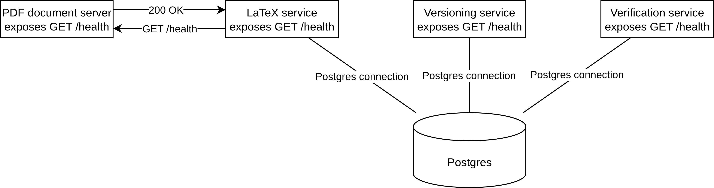

# System Architecture Document
## System Purpose
For background, there are programs, such as Lean, Coq, and Agda, that provide a standard format for mathematical proofs and automatically verify those proofs.
I will refer to these as *theorem proving languages* and *formal verification languages*, though there is technically a subtle difference between the two terms.
These have been used to prove [that the fifth busy beaver number is 47176870](https://github.com/ccz181078/Coq-BB5) and [the Kepler Conjecture](https://arxiv.org/abs/2402.08032v1), among other recent results in mathematics.

The purpose of this system is to provide a library for people to share and reference mathematical proofs that have been formally verified using these languages.
For instance, if I've proved that [$P \neq NP$](https://www.claymath.org/millennium/p-vs-np/),
    then I want to be able to publish a `.pdf` file explaining the proof in a human-readable way,
    publish a `.lean` package so that others can use my new thoerems and lemmas in their own formal proofs,
    provide a clean way to show that my proof doesn't contain logical errors,
    and link my theorem the results that it uses and is used by.
Currently, the most similar systems are preprint servers for publishing academic papers and the package managers for theorem proving languages.
Preprint servers typically track citations and publish their human-readable proofs, but they typically don't integrate with formal verification software.
In addition, these are often inaccessible to amateur mathematicians, and large, crowd-sourced projects that might not have the time or ability to integrate with the academic world.
There are also the package managers for different theorem proving software, such as [Reservoir for Lean](https://reservoir.lean-lang.org/) and [Opam for Coq](https://opam.ocaml.org/packages/coq/).
These obviously do integrate with formal verification software, and do track dependencies, but they don't have integrated support for human-readable proofs, and the dependency lists don't differentiate between mathematical results that are central to the proof and sofware dependencies needed for formalizing the proof.

Note that proofs in this system are tracked as specific commit hashes in specific repositories.
This is because specific commit hashes uniquely identify the *content* of the repository, so we can prevent proof verification results from getting invalidated.

Users will interact with this service via a REST API that could be integrated into a web frontend, a package manager, or a cli tool.
The user of this system will create their formally verified proof in Lean 4 with the following structure:
```
.
|-lakefile.toml
|-...remainder of Lean 4 package structure
|-math-dependencies.json <- specifies which dependencies are for math and not software
|-latex-source
  |-main.tex <- entry point for compiling paper
  |-...other files for paper
```
`math-dependencies.json` will contain a list with the shape
```json
[
  {
    "packageName": "<insert package name from lakefile.toml>",
    "git": "<insert package name from lakefile.toml>",
    "commit": "<exact commit hash>",
  },
  ...
]
```
Then, the user will upload this proof a third-party as a publicly-accessible Git repository.
Then, the user will upload the URL and commit hash of their proof to this service.
Then, this service will pull the specific commit from the specific repository
Then, this service will verify that `math-dependencies.json` is consistent with the rest of the repository.
Then, this service will simultaneously compile the LaTeX document and verify the formal proof asynchronously.

Users will be able to query
- The compiled paper for any given proof
- Metadata about about a proof, which includes the Git repository, the latest working version, Lean 4 verification and LaTeX compilation status (untested, success, fail, running), and mathematical dependencies.
- Analytics about proofs, such as transitive dependency lists, number of packages used, etc.

Users will be able to trigger re-testing of any given proof.

## Service Boundaries


### Dependency Service
This service is responsible for managing dependency data and exposing analytics queries on this dependency data.
For instance, users will be able to query a list of proofs that any given proof depends on.
This service will pull only `lakefile.toml`, and `math-dependencies.json` from the Git repository to validate it and add all of the metadata to the database.
For almost all of its functionaltiy, this service can function independently, since it only makes queries to the database.

#### Dependencies
- This service depends on the database.

### Verification Service
This service is responsible for managing Lean 4 test runs and queuing up those runs.
This is a separate service because compiling and running Lean 4 packages is a slow task that should be able to scale independently.
This will also asynchronously update the Lean status of each Git repo/commit pair in the database.

#### Dependencies
- This service depends on the database.

### PDF Server
This service handles storing and serving PDF documents containing the human readable proofs.
This is separate from the other services since large file transfers are a large workload that shouldn't interfere with (comparatively) quick tasks like querying the database.

#### Dependencies
- No dependencies.

### LaTeX Service
This service compiles LaTeX files and handles queueing of LaTeX jobs.
This is a separate service because compiling LaTeX projects is a slow task that should be able to scale independently.
This will also asynchronously update the LaTeX status of each Git repo/commit pair in the database.

#### Dependencies
- This service depends on the database.
- This service depends on the PDF Server.

## Data Flow
### Healthcheck
Healthcheck data will be automatically collected by Docker and used to manage container starting and killing.

## Communication Patterns
### Healthcheck
All healthchecks, except for those provided by off-the-shelf containers, will be served on `/health`.
These healthcheck responses will have the format
```json
{
  "service": "service-name",
  "status": "healthy",
  "dependencies": {
    "dependent-service": {
      "status": "healthy",
      "response_time_ms": 15
    }
  }
}
```
The status code will reflect the health of the container itself, not its dependencies, so that Docker doesn't restart containers because of unhealthy dependencies.

## Technology Stack
This project will use FastAPI for all of the APIs and use Posgres for the database.
